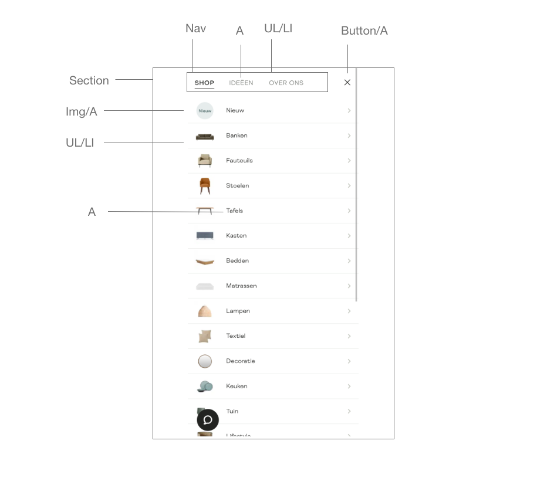

# Procesverslag
Markdown is een simpele manier om HTML te schrijven.  
Markdown cheat cheet: [Hulp bij het schrijven van Markdown](https://github.com/adam-p/markdown-here/wiki/Markdown-Cheatsheet).

Nb. De standaardstructuur en de spartaanse opmaak van de README.md zijn helemaal prima. Het gaat om de inhoud van je procesverslag. Besteedt de tijd voor pracht en praal aan je website.

Nb. Door *open* toe te voegen aan een *details* element kun je deze standaard open zetten. Fijn om dat steeds voor de relevante stuk(ken) te doen.

## Jij

uitwerken voor kick-off werkgroep

### Auteur:
Vera Hendriks

#### Je startniveau:
Blauwe piste en af en toe rode piste

#### Je focus:
Responsive
 

## Je website

uitwerken voor kick-off werkgroep

### Je opdracht:
https://www.made.com/nl/

#### Screenshot(s) van de eerste pagina (small screen): 

#### Screenshot(s) van de tweede pagina (small screen):

 

## Breakdownschets (week 1)

uitwerken na afloop 2e werkgroep

### de hele pagina: 
De gehele pagina zag er op het moment dat ik de breakdownnschets aan het maken was anders uit.

### dynamisch deel (bijv menu): 

### wellicht nog een dynamisch deel (bijv filter): 

## Voortgang 1 (week 2)

uitwerken voor 1e voortgang

### Stand van zaken
Ik was op dit moment nog helemaal niet ver met mijn code, dus vandaar de keuze dat ik niet heb deelgenomen aan het voortgangsgesprek. Tijdens het voortgangsgesprek ben ik verder gegaan met het schrijven van mijn code. Volgende week ga ik zeker wel deelnemen aan het gesprek en hoop ik een stuk verder te zijn dan deze week.

### Agenda voor meeting
Hier moesten we een agenda samenstellen met het groepje voor het voortgangsgesprek. Helaas hebben we dat niet gedaan, doordat we allemaal niet ver waren met onze code. Dit is de reden dat ik dit deel voor deze keer leeglaat, volgende week gaan we wel een agenda samenstellen.

### Verslag van meeting
De uitkomsten van het voortgangsgesprek heb ik niet vast kunnen leggen, omdat ik niet heb deelgenomen aan het voortgangsgesprek.

## Voortgang 2 (week 3)

uitwerken voor 2e voortgang

### Stand van zaken
Dinsdag 21 september:
Het begin vond ik erg lastig en ik wist niet echt waar ik moest beginnen. Eenmaal begonnen ging dit een stuk beter en werk ik de homepagina per deel uit om zo niet de weg kwijt te raken. Wel loop ik vast op een paar dingen, dit zijn dingen zoals: Hoe plaats ik het logo in het midden? Er zit nu een witte lijn rechts als ik naar links beweeg, hoe haal ik deze weg? Hoe plaats ik verschillende soorten teksten over de afbeelding en hoe hou ik de afbeelding dan ook een link? Hoe krijg ik de prijzen onder de afbeeldingen van de producten allemaal op dezelfde plaats? Ik hoop deze vragen beantwoord te krijgen in het voortgangsgesprek, door de docent, de student-assistenten of door te zoeken op google. 

Woensdag 22 september:
Ik typ nog even een stukje tekst wat nu de stand van zaken is. In het vorige stukje tekst liep ik vast met dat ik een witte lijn aan de rechterkant van de pagina had als ik naar links bewoog, dit is nu opgelost. Verder liep ik vast met hoe ik verschillende soorten teksten over de afbeelding kon plaatsen en hoe hou ik de afbeelding dan ook nog een link, dit heb ik gevraagd in de werkgroep vandaag en ben ik aardig goed mee op weg.

De andere twee vragen heb ik nog niet opgelost, dit waren de vragen hoe ik het logo in het midden moet plaatsen en hoe ik de prijzen onder de afbeeldingen van de producten allemaal op dezelfde plaats krijg. De student-assistent zei dat ik dit waarschijnlijk kan uitvinden als ik terugkijk naar een van de opdrachten die we hebben gehad, dit is de opdracht over grid en media queries. Bij deze werkgroep ben ik ook helaas niet geweest, dus dit is de reden dat ik deze opdracht niet heb gemaakt. Vandaar dat ik hier beneden in de agenda dit ook nog zou willen bespreken in het voortgangsgesprek. 

Verder heb ik nog als tips van de student-assistent gekregen dat ik beter kan beginnen met het ordenen van mijn HTML door alle HTML-elementen voor de content al te plaatsen, geen classes te gebruiken en mijn CSS ordenen door blokjes boven de sections te plaatsen. Plus dus nog terugkijken naar de opdracht over grid en media queries en deze nog te gaan maken.

### Agenda voor meeting

Vera

Ik wil graag bespreken: 
Hoe je iets responsive maakt (bijvoorbeeld een afbeelding) en meer uitleg over de grid en media queries.

Sidney

Ik wil graag bespreken: 
Meer uitleg over een sideways hamburger menu en JavaScript transitions van de homepage.

Martha

Ik wil graag bespreken: 
Hoe je iets responsive maakt, een hamburger menu maakt en tekst op afbeeldingen plaatst.

### Verslag van meeting

- Mijn code ziet er tot nu toe prima uit. 
- Ik kan nu het best beginnen met het ordenen van mijn HTML en CSS.
- Verder nog terugkijken naar de opdracht over grid en media queries.

## Toegankelijkheidstest (week 4)

uitwerken na test in 8e voortgang

### Bevindingen
Lijst met je bevindingen die in de test naar voren kwamen:

#### Screen reader
De screen reader leest het redelijk goed voor alleen kan ik bij sommige afbeeldingen nog een alt toevoegen, zodat het duidelijk is wat is er te zien is op de afbeelding.

#### Brillen 
Met de brillen merkte ik dat het fijner is om meer contrast te hebben en grotere tekst. Er is al genoeg contrast op mijn website maar op sommige tekst kan wel iets groter.

#### Elektrische stimulator
Met de elektrische stimulator merkte ik dat het fijn is dat de knoppen/linkjes wat groter zijn dan alleen het formaat van de knoppen/linkjes. Dit doe ik al bij de linkjes die ook afbeeldingen zijn maar zou ik nog beter kunnen doen bij de knoppen en het logo.

#### Muis en toetsenbord
Tijdens de test met muis en toetsenbord heb ik een paar dingen gevonden. Op dit moment heb ik het menu nog niet, in het menu wordt de focus state onzichtbaar en daar zou ik op kunnen letten. Op dit moment heb ik nog geen hover states maar hij weet wel wanneer ik op iets kan klikken. Ik kan ook nog letten op de active state voor mensen die een trage computer hebben, zodat ze weten dat de website aan het laden is.

## Voortgang 3 (week 4)

uitwerken voor 3e voortgang

### Stand van zaken
Op dit moment ben ik bezig met het afmaken van mijn eerste pagina (homepagina) en deze responsive te maken. Ik heb moeite met het menu in de header en footer, ik weet niet in hoeverre deze responsive moeten zijn. Op de echte website zijn de menu's erg groot en ik weet niet wat ik hiervan moet meenemen. Voor de rest moet ik gewoon mijn eerste pagina (home) afmaken en beginnen met mijn tweede pagina.

### Agenda voor meeting

Vera

Ik wil graag bespreken: 
Ik vraag me af in hoeverre het responsive moet zijn (over het menu).

Sidney

Ik wil graag bespreken: 
Ik heb op moment geen vragen.

Martha

Ik wil graag bespreken: 
Hoe je iets responsive maakt. 

### Verslag van meeting

- Ik weet nu aan de hand van de uitleg hoe ik het menu van de header en footer moet uitwerken (zie hier beneden resultaat).
- Ook weet ik nu beter hoe ik mijn homepagina (afbeeldingen met stukjes tekst) responsive maak.

## Eindgesprek (week 5)

uitwerken voor eindgesprek

### Stand van zaken
Ik vond het vooral lastig om te beginnen, ik wist niet zo goed waar ik moest beginnen en dit was erg demotiverend. Toen ik eenmaal was begonnen ging het redelijk goed en had ik wel de smaak te pakken. Toch vond ik het responsive gedeelte het moeilijkst, dit komt mede doordat ik precies deze werkgroep ook had gemist, maar na een voortgangsgesprek met de docent snapte ik dit ook een stuk meer en ging het ook een stuk makkelijker.

### Screenshot(s)

Screenshot(s) van je eindresultaat (links van Made, rechts van mij)

## Bronnenlijst

continu bijhouden terwijl je werkt

1. Veel hulp van student-assistenten, docent en andere studenten.
2. DLO - Flexbox - Oefening 1 
3. DLO - Grid en Media Queries - Oefening 3
4. Vooral de opdrachten tijdens de lessen
5. https://flexboxfroggy.com/#nl
6. https://cssgridgarden.com/#nl
7. https://css-tricks.com/snippets/css/complete-guide-grid/
8. https://www.w3schools.com/css/css3_variables.asp
9. https://www.w3schools.com/css/css3_mediaqueries.asp
10. https://www.w3schools.com/css/css3_transitions.asp
11. https://www.w3schools.com/css/css_z-index.asp
12. https://www.w3schools.com/css/css_positioning.asp

